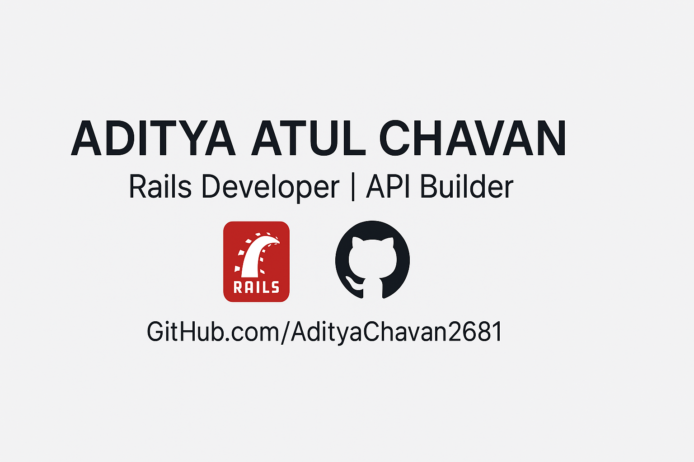

<h1 align="center">👋 Hi, I'm Aditya — Support Engineer & Full Stack Rails Developer</h1>

💬 Rails + Support = Systems That Scale with Empathy 
🧠 Building clean architecture, documenting with purpose, and delivering beyond expectations

  

  
  
  
  
  

---

### 🔧 What I Build

- 💼 **Client Projects (Private Repos)**  
  As a Junior Full Stack Developer, I’ve built and delivered production-grade Rails systems across domains:
  - `Litigation-Management`: Automating legal workflows for case tracking and compliance  
  - `OHC`: Healthcare dashboard for distributed workforce  
  - `DPL-OHC`: Pharma operations platform with role-based user workflows  

- 🔌 **API Labs**  
  [`Messages API`](https://github.com/AdityaChavan2681/Messages-api) • [`Secret Menu`](https://github.com/AdityaChavan2681/Secret-menu-api) • [`Bands API`](https://github.com/AdityaChavan2681/Bands-Api)

- ⚙️ **DevOps & Infra Testing**  
  [`CI-CD Testable`](https://github.com/AdityaChavan2681/CI-CD-Testable) • [`AWS Test`](https://github.com/AdityaChavan2681/AWS-Test) • [`Typing Redirect`](https://github.com/AdityaChavan2681/typing-redirect)

- 🎨 **Frontend Experiments**  
  [`Rails-Vue`](https://github.com/AdityaChavan2681/Rails-Vue) • [`Ajax Rails`](https://github.com/AdityaChavan2681/Ajax-rails) • [`Chat Room`](https://github.com/AdityaChavan2681/Chat-room)

- 📘 **Core Rails Projects**  
  [`Alpha Blog`](https://github.com/AdityaChavan2681/alpha-blog) • [`Library App`](https://github.com/AdityaChavan2681/Library-App) • [`Ruby Basics`](https://github.com/AdityaChavan2681/Ruby-basics)

---

### 🗺️ Dev Journey Roadmap

Every repo is a milestone. Every commit reflects architecture, clarity, and intent.

---

### 📚 About Me

I'm a Rails developer who believes in **clarity through code and precision in support**.  
Every commit reflects a lesson in architecture, delivery, or user empathy.  
I learn by building, documenting, and refining—and I’m always open to meaningful collaboration.

Thanks for visiting—let’s build something brilliant together ⚙️💡

---

### 📬 Connect

- [LinkedIn](https://www.linkedin.com/in/adityaatulchavan/)  
