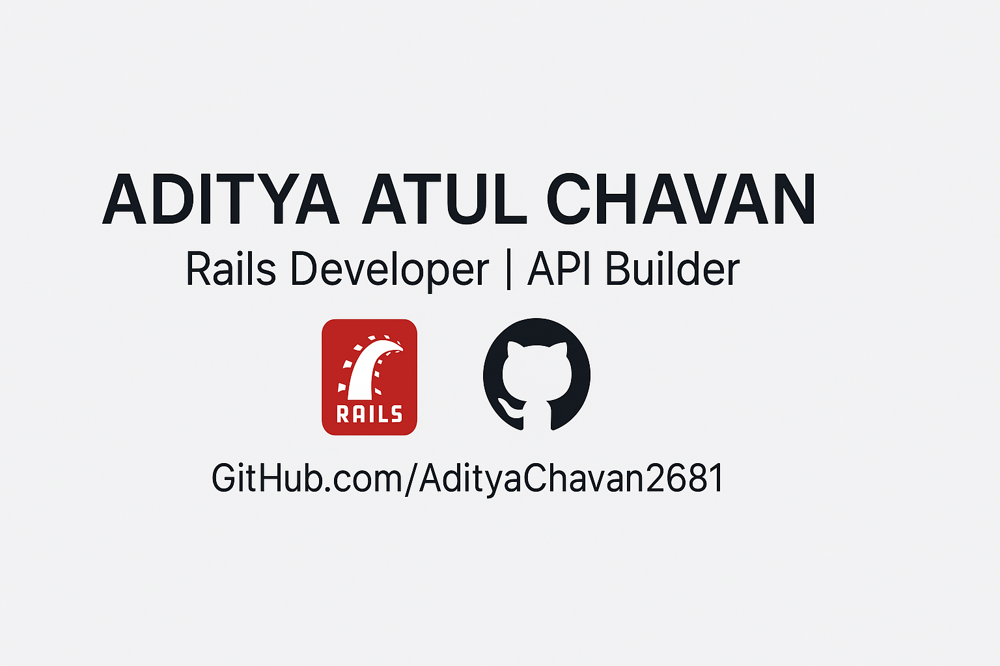

<h1 align="center">👋 Hi I'm Aditya, A Support Engineer & Full Stack Rails Developer</h1>

💬 Rails + Support = Systems That Scale with Clarity 
🧠 To build clean architecture, document with purpose, and deliver beyond expectations

  

  
  
  
  
  

---

### 🔧 What I Built

- 💼 **Client Projects (Private Repos)**  
  As a Junior Full Stack Developer, I have built and delivered production-grade Rails systems across Healthcare domains such as:
  - `Litigation-Management`: Automating legal workflows for tracking cases and compliance  
  - `OHC`: Healthcare dashboard for distributed workforce  
  - `DPL-OHC`: Pharma operations platform with role-based user workflows  

- 🔌 **API**  
  [`Messages API`](https://github.com/AdityaChavan2681/Messages-api) • [`Secret Menu`](https://github.com/AdityaChavan2681/Secret-menu-api) • [`Bands API`](https://github.com/AdityaChavan2681/Bands-Api)

- ⚙️ **DevOps Testing**  
  [`CI-CD Testable`](https://github.com/AdityaChavan2681/CI-CD-Testable) • [`AWS Test`](https://github.com/AdityaChavan2681/AWS-Test) • [`Typing Redirect`](https://github.com/AdityaChavan2681/typing-redirect)

- 📘 **Core Rails Projects**  
  [`Alpha Blog`](https://github.com/AdityaChavan2681/alpha-blog) • [`Library App`](https://github.com/AdityaChavan2681/Library-App) • [`Ruby Basics`](https://github.com/AdityaChavan2681/Ruby-basics)

---

### 🗺️ Dev Journey

Every repo is a step. Every commit reflects thinking, clarity, and intent.

---

### 📚 About Me

I have worked as a Support Engineer & Rails developer who believes in **clarity through code and understanding in support**.  
Every project reflects the depth and ideas to go above, and beyond in architecture, delivery, or user empathy.  
I learn by exploring, understanding, and establishing to hone my skills best as a Developer, I am always open to meaningful collaborations.

Thanks for visiting, let’s build something brilliant together ⚙️💡

---

### 📬 Connect

- [LinkedIn](https://www.linkedin.com/in/adityaatulchavan/)  
